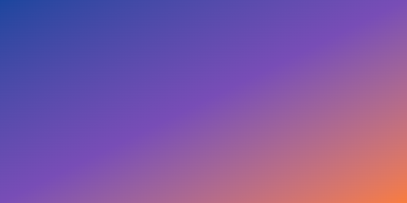
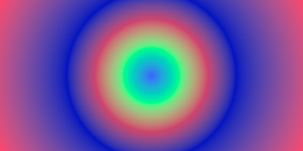
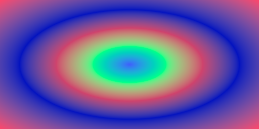

# colors

Modern Go library for color space conversions and CSS color serialization.

## Usage

```go
import "github.com/thmalt/colors"
```

## Examples

### Color and Color Spaces

```go
package main

import (
	"image"
	"image/png"
	"log"
	"os"
	"path/filepath"

	"github.com/thmalt/colors"
	"github.com/thmalt/colors/gradient"
)

var (
	blue   = colors.Oklab(0.42, -0.02, -0.15)
	purple = colors.Oklab(0.52, 0.08, -0.14)
	orange = colors.Oklab(0.72, 0.12, 0.12)

	// css: in oklab, #1b469e, #504baa, #784db6, #b56c8a, #f87c3e
	linearGradient = colors.NewGradientBuilder().
			AddStop(blue).
			AddStop(blue.Mix(purple, 0.5), 0.25).
			AddStop(purple, 0.5).
			AddStop(purple.Mix(orange, 0.5), 0.75).
			AddStop(orange, 1).
			Build()

	// css: in oklab, #3f5efb 0%, #00ff88, #ce436d, #0413bf 50%, #fc466b
	radialGradient = colors.NewGradientBuilder().
			AddStop(colors.Rgb(63, 94, 251)).
			AddStop(colors.Rgb(0, 255, 136)).
			AddStop(colors.Rgb(206, 67, 109)).
			AddStop(colors.Rgb(4, 19, 191), 0.5).
			AddStop(colors.Rgb(252, 70, 107)).
			Build()

	// css: in oklab, #f69d3c, 10deg, #3f87a6, 350deg, #ebf8e1
	conicGradient = colors.NewGradientBuilder().
			AddStop(colors.Rgb(0xf6, 0x9d, 0x3c)).
			AddHint(gradient.DegToTurn(10)).
			AddStop(colors.Rgb(0x3f, 0x87, 0xa6)).
			AddHint(gradient.DegToTurn(350)).
			AddStop(colors.Rgb(0xeb, 0xf8, 0xe1)).
			Build()
)

const width, height = 512, 256

func main() {
	// Create geometric gradients.

	// css: linear-gradient(to bottom right, ...)
	linearSpec := gradient.NewLinearSpec()
	linearSpec.SetSize(width, height)
	linearSpec.SetDirection(gradient.ToBottomRight)
	linear, err := linearSpec.Build()
	if err != nil {
		log.Fatal(err)
	}

	// css: radial-gradient(farthest-corner ...)
	radialSpec := gradient.NewRadialSpec()
	radialSpec.SetSize(width, height)
	radial, err := radialSpec.Build()
	if err != nil {
		log.Fatal(err)
	}

	// css: conic-gradient(from 0.25turn at 50% 30%, ...);
	conicSpec := gradient.NewConicSpec()
	conicSpec.SetSize(width, height)
	conicSpec.SetCenter(0.5, 0.3)             // 50% 30%
	conicSpec.SetStartAngle(gradient.ToRight) // 0.25turn
	conic, err := conicSpec.Build()
	if err != nil {
		log.Fatal(err)
	}

	// Render conic gradient.
	// css: conic-gradient(from 0.25turn at 50% 30% in oklab, #f69d3c, 10deg, #3f87a6, 350deg, #ebf8e1);
	conicImage := renderImage(width, height, func(x, y float64) colors.Color {
		t := conic.PositionAt(x, y)
		return conicGradient.At(t)
	}, true)
	saveImage("output/conic.png", conicImage)

	// Render linear gradient.
	// css: linear-gradient(to bottom right in oklab, #1b469e, #504baa, #784db6, #b56c8a, #f87c3e)
	linearImage := renderImage(width, height, func(x, y float64) colors.Color {
		t := linear.PositionAt(x, y)
		return linearGradient.At(t)
	}, true)
	saveImage("output/linear.png", linearImage)

	// RadialCircle
	radialSpec.SetShape(gradient.RadialCircle)
	radial, err = radialSpec.Build()
	if err != nil {
		log.Fatal(err)
	}

	// Render circular radial gradient.
	circleRadialImage := renderImage(width, height, func(x, y float64) colors.Color {
		t := radial.PositionAt(x, y)
		return radialGradient.At(t)
	}, true)
	saveImage("output/radial-circle.png", circleRadialImage)

	// RadialEllipse
	// css: radial-gradient(circle in oklab, #3f5efb, #00ff88, #ce436d, #0413bf 50%, #fc466b)
	radialSpec.SetShape(gradient.RadialEllipse)
	radial, err = radialSpec.Build()
	if err != nil {
		log.Fatal(err)
	}

	// Render elliptical radial gradient.
	// css: radial-gradient(in oklab, #3f5efb, #00ff88, #ce436d, #0413bf 50%, #fc466b)
	ellipseRadialImage := renderImage(width, height, func(x, y float64) colors.Color {
		t := radial.PositionAt(x, y)
		return radialGradient.At(t)
	}, true)
	saveImage("output/radial-ellipse.png", ellipseRadialImage)

}

func renderImage(width, height float64, fn func(x, y float64) colors.Color, dither bool) *image.RGBA64 {
	w, h := int(width), int(height)
	img := image.NewRGBA64(image.Rect(0, 0, w, h))

	for y := range h {
		for x := range w {
			// Sample at pixel centers to avoid sampling at pixel corners. +0.5
			c := fn(float64(x)+0.5, float64(y)+0.5)

			if dither {
				// Apply ordered dithering to reduce visible banding during quantization.
				c = c.Dither(x, y)
			}

			img.SetRGBA64(x, y, c.ToRGBA64())
		}
	}

	return img
}

func saveImage(file string, img image.Image) error {
	if err := os.MkdirAll(filepath.Dir(file), 0o755); err != nil {
		return err
	}

	f, err := os.Create(file)
	if err != nil {
		return err
	}
	defer f.Close()

	if err := png.Encode(f, img); err != nil {
		return err
	}

	return nil
}
```

<p align="center">
	
	
	<br>
	
	
</p>